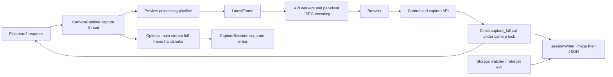

# Prototype 0.1 — software architecture and assurance review

**Date:** 6 September 2026  
**Response to:** [revised software progress report](progress-report.md)  
**Baseline:** working tree based on Git commit `64626e3`; the revised progress report was already modified by the user.  
**Scope:** code-informed system review of acquisition, concurrency, processing, storage, API/UI, deployment and verification. Calibration mathematics and optical engineering are excluded.

## 1. Principal engineer's assessment

**Keep the stack, but strengthen its contracts before expanding recording.** Python, Picamera2, FastAPI, Pydantic, a latest-frame preview bus and offline analysis are reasonable choices for this prototype. The code has useful separation and readable failure history. There is no evidence here that a new language, web framework, transport or wholesale rewrite would improve delivery.

The principal weakness is that several important guarantees exist in comments and the progress report more strongly than in the implementation. “One camera consumer”, “device disappearance detected”, “exact settings alongside pixels”, “safe release” and “healthy preview” are not yet reliable end-to-end properties. These are system-level issues: repairing individual symptoms without defining ownership, completion and validity will allow the same failure classes to recur.

I would continue supervised bench use, while prioritising the data-integrity and lifecycle work below before calling 0.1 qualified for unattended or continuous scientific recording. This is not a finding that existing captures are necessarily invalid; it identifies paths that can produce misleading records or status under specific transitions and faults.

### Review evidence and limits

Inspected the active `src/trilobite` orchestration, camera backends, frame bus/types, pipeline and stages, state store, storage writer/device handling, web routes and dashboard JavaScript; sampled capture-session orchestration, offline readers, tests and deployment/network scripts. Also checked the retained `src/flyeye` implementation and service. This was architectural tracing of representative paths, not an exhaustive defect or security audit.

Executed the 320-test suite on Windows/Python 3.13 in an isolated `.venv-review` environment and ran deterministic probes against the actual classes using temporary files. Initial suite result: **311 passed, 9 failed in 36.74 s**. Seven failures came from tests using the real default user data directory outside the sandbox. Follow-up resolved those: six passed with filesystem access; the remaining state test passed with only its default storage location redirected to a temporary directory. The follow-up rotation-file run itself reported 48 passes and one temporary-directory permission error, which prompted that final targeted run. **Two Windows portability failures remain**, both assertions about directory `fsync` counts. This is not an unmodified all-green suite result.

Dependencies were newly resolved from the permitted version ranges, not copied from the Pi: pytest 9.1.1, NumPy 2.5.2, OpenCV headless 5.0.0.93, Pydantic 2.13.5, FastAPI 0.141.1, Starlette 1.6.0 and HTTPX 0.28.1. No Pi, attached camera, removable-device failure, power-loss test, MATLAB runtime or live browser test was exercised. Runtime behaviours inferred from those environments remain qualification tasks. Application source and existing tests were not changed.

## 2. What the implementation actually does

The preview path is separated from disk writing and JPEG encoding. The still path is **not** fully mediated by the capture thread. The optional handshake serves processed `main` frames; it does not currently replace raw still capture. The diagram intentionally shows that distinction.

### Decisions worth retaining

| Decision | Evidence and practical value |
|---|---|
| Small preview separate from native still data | `Picamera2Source.open/read_preview/capture_full` keep preview work out of the saved raw path. This is the right foundation for resource budgeting. |
| Latest-wins preview | `LatestFrame` uses a condition/version counter and bounded storage. Slow viewers do not create an ever-growing frame backlog. |
| Declarative stage parameters | `StageParams`, stage registry and JSON-schema controls share validation and UI descriptions. Keep this instead of duplicating parameter rules. |
| Synthetic sources and API tests | They exercise a substantial part of the application without the Pi. Existing orientation, parameter and reader seam tests are valuable. |
| Configuration plus runtime overlay | Preserving the hand-written YAML and recording runtime decisions separately is sound. The persistence mechanism needs stronger guarantees, not a different configuration format. |
| Explicit host/storage diagnostics | Subprocess calls in the reviewed diagnostics use argument lists and timeouts. Useful degradation on Windows keeps development practical. |
| Lossless arrays and sidecars | Accessible to Python and MATLAB, easy to inspect, and appropriate for 0.1 stills. Retain them while adding a versioned recording contract. |

## 3. Priority findings

**P1:** resolve before relying on the affected measurement/recovery guarantee. **P2:** resolve before unattended use, feature expansion or a stable field release. “Reproduced” means a deterministic desktop probe or test; “code-confirmed” means the path is directly present, without claiming its failure frequency on the Pi.

### F1 — P1: camera ownership is split across execution contexts

**Evidence:** [CameraRuntime.capture_still](../src/trilobite/app.py#L163) calls `source.capture_full()` from the synchronous API handler. [Picamera2Source.capture_full](../src/trilobite/cameras/picam.py#L254) calls `capture_request()` itself. `read_preview` and `skip_preview` do so on the capture thread. A shared `_lock` prevents simultaneous entry, but does not create the single SDK owner claimed by report §3.2. Controls also enter through the API worker. `grab_full()` uses the separate handshake, which has a timeout and returns `main`, not raw.

**Consequence:** still requests and controls contend with preview acquisition; request identity, cancellation and shutdown span two paths. The prior two-consumer failure class has not been structurally eliminated, although this locking may prevent its original manifestation. Do not infer a current Pi crash from source inspection alone.

**Recommendation:** give each head one acquisition owner. Submit bounded commands for native/raw or processed stills and controls, each with a request ID, deadline and terminal outcome. Fulfil frame requests from an owned SDK request. Copy/retain data according to the SDK's documented lifetime before handing it to consumers. Keep disk and JPEG work outside that owner. Use a queue/future contract rather than an uncorrelated shared pending flag for potentially concurrent callers.

**Acceptance:** a fake SDK records every request-taking thread during simultaneous previews, controls and still requests: exactly one owner per head; all requests finish, fail or cancel by deadline; SDK buffers are released even on decode failure. Then verify on Pi. This is higher value than simply adding another mutex.

### F2 — P1: storage presence and safe-release guarantees are not implemented

**Evidence:** [devices.is_mounted](../src/trilobite/storage/devices.py#L484) walks up to an existing ancestor and tests writability. Despite its comment, it does not compare device IDs or retain the selected filesystem identity. A nonexistent descendant and an ordinary writable directory both report present in the review probe. [check_and_recover](../src/trilobite/storage/writer.py#L292) trusts that result.

[release/retarget](../src/trilobite/storage/writer.py#L251) switch the target under `_lock`, but `save_still` only holds that lock while allocating a counter. A probe paused an image write to the old target: **`release()` returned while that write remained pending**. The UI's advice to release and then remove the disk is therefore not an established safe handoff.

**Consequence:** removal can leave a writable mount-point directory backed by the internal disk, defeating the intended protection against writes to the wrong filesystem. Release can acknowledge the new destination before old writes complete. Also, an `EmptyWriteError` does not quarantine a mounted, writable device: recovery can return false and later captures continue targeting it.

**Recommendation:** identify the target at selection time using the actual mount/device identity, not only its pathname. Maintain a storage generation and in-flight write ownership. Release must stop new writes to that generation, drain or explicitly fail existing work, and only then acknowledge it as releasable. Distinguish absent, read-only, full, corrupt and temporarily slow states. For stills, fallback may remain an explicit policy, with a durable record of the destination change and a reserved internal-space floor.

**Acceptance:** test mount disappearance while the directory remains writable, replacement by another volume at the same path, release during image/sidecar writes, a full but still-mounted disk and a short write on an apparently healthy disk. Preserve and report all outcomes; no success may name an unverified target.

### F3 — P1: captures are individual file writes, not committed data packages

**Evidence:** [save_still](../src/trilobite/storage/writer.py#L384) writes the image and then JSON directly to their final names. Only the image write is inside the recovery `try` block. A sidecar failure leaves an orphaned image and fails the request without equivalent recovery. [capture_all](../src/trilobite/web/server.py#L784) loops through cameras and completes each write before requesting the next; it returns per-head errors but persists no common pair transaction or capture-set ID.

The writer correctly returns success only after both individual writes and size checks succeed. That is useful, but interruption/retry, cross-head grouping and final-file discovery remain underspecified. A size check checks length, not all corruption or physical persistence. Directory-sync failures are swallowed, including on filesystems other than Windows.

**Recommendation:** add a small versioned capture manifest with run ID, capture-set ID, head/frame IDs, target generation, filenames, content hashes, expected members and state (`pending`, `complete`, `partial`, `failed`). Write temporary members and publish completion last with an explicit recovery protocol. On startup, reconcile incomplete captures. Make retries idempotent so a network timeout can be queried rather than blindly recaptured. Record strict versus reduced durability capability.

The parked `CaptureSession` has a second writer, a fixed root and its own sidecar/index format ([recording path](../src/trilobite/calibration/session.py#L581)). It does not inherit `SessionWriter` retargeting merely because it uses the same durable-write helpers. Keep it disabled for supported field capture until it uses the same storage transaction service, or explicitly declares a separate contract.

**Acceptance:** interrupt at every file/manifest boundary; simulate one-head failure and a lost HTTP response after successful commit. A reader must distinguish complete, partial and corrupted sets without guessing from filenames. Previously acknowledged complete captures must reopen correctly after process restart and, on the Pi qualification target, after controlled power interruption.

### F4 — P1: provenance is sampled after acquisition, not bound to the frame

**Evidence:** [capture_still and capture_preview](../src/trilobite/app.py#L163) call `pipeline.settings_snapshot()` after obtaining their frame. A probe rendered and published a preview with gain 1, changed the live stage to gain 2, then saved the existing preview. The stored pixel remained 20, while the sidecar claimed gain 2. No concurrency timing trick was needed.

[Pipeline.__call__](../src/trilobite/processing/pipeline.py#L38) snapshots stage references, not an immutable pipeline execution configuration. Individual stages sometimes capture a local parameter reference, but the overlay rereads `self.params` across an invocation. Binding code also mutates parameter fields individually. Pydantic validation and replacing a parameter object do not make the entire frame's configuration atomic. Raw pixels bypass display processing, but their accompanying alignment/configuration record can still be sampled from the wrong revision.

**Recommendation:** associate an immutable configuration revision with each exposure and a processing revision/result record with each derived frame. Snapshot once at the frame boundary and preserve ordered stage configuration, successful/skipped/failed stage outcomes, orientation and actual sensor metadata. Distinguish requested controls, acknowledged requests and effective exposure controls. Persist exactly that record with the pixels. Never reconstruct it from current UI state.

**Acceptance:** pause a frame between stages, update settings and orientation, then resume; every saved frame must describe one valid revision. Saving an old preview must retain the old processing record. Readers should reject missing mandatory provenance for measurement while allowing explicitly labelled inspection mode.

### F5 — P2: liveness and degradation are not sufficiently observable

**Evidence:** `Pipeline.__call__` catches a stage exception, logs it and passes the frame onward. The existing test deliberately checks this behaviour; the review probe confirmed the unchanged frame carries no failure metadata. `CameraRuntime.errors` does not see those caught failures. `RateMeter.fps` computes from the last tick samples without ageing them out, so it can retain a nonzero number after frames stop. `status.sensor_fps` is the configured rate, not a measured exposure rate. The MJPEG generator can retransmit the last frame after timeout, and the dashboard suppresses status-fetch exceptions.

**Consequence:** graceful degradation can look like successful operation. An open camera handle, a live HTTP connection and a last-known FPS value do not prove current acquisition or successful processing.

**Recommendation:** keep preview pass-through if useful, but attach failure status and make it visible. Add last-acquired/published timestamps, frame age, measured sensor cadence, stage error counters, request queue age, last successful write, data-validity state and storage health. Mark stale images clearly. Rate-limit recurring logs without removing counters. Cache slow diagnostics outside the control-request critical path.

`Frame.seq` counts software deliveries rather than every sensor exposure: the Pi skip path does not increment it, unlike the synthetic default skip. `Frame.now` timestamps construction after acquisition/copy work. Document these fields accurately and separately preserve driver exposure timestamps and their clock semantics. Current sequence gaps and host timestamps are not sufficient drop or synchronisation evidence.

**Acceptance:** freeze a source after steady operation, throw from a stage and interrupt status polling. Within a declared freshness deadline the UI/API must show which function failed; it must not keep reporting the last healthy rate as live.

### F6 — P2: lifecycle and state persistence need stronger boundaries

**Evidence:** [CameraRuntime.stop](../src/trilobite/app.py#L103) joins for five seconds, then closes the source without establishing that the acquisition thread exited. Blocking SDK capture can therefore outlast the join. `Picamera2Source.open` only assigns its local camera object to `self._picam` after successful startup, leaving exception cleanup dependent on external behaviour. `Application.start` starts threads before restoring all runtime state; later manifest/startup failure is not handled by a universal rollback. The command entry point returns on startup failure outside its normal stop `finally` block.

[StateStore.save](../src/trilobite/state.py#L82) uses write/rename but no file/directory `fsync`; atomic replacement is not a measured power-loss durability guarantee. A deterministic probe marked state dirty between snapshot and replacement, then observed `save()` clear that notification. The next autosave may miss the later change. The saved pipeline is a parameter dictionary; runtime-added/deleted stage topology is not reconstructed by `apply_state`, which applies values to the YAML-created pipeline. Clarify whether live topology edits are intentionally temporary.

**Recommendation:** explicit `starting → running/degraded → stopping → stopped/failed` states, bounded request cancellation and guaranteed cleanup of partially opened resources. A timeout must become a visible failed-stop outcome, not an assertion that ownership ended. Persist state revisions, acknowledge the saved revision, and clear dirty status only for that revision. Reuse an appropriate durable replacement helper. Restore and validate configuration before publishing measurement-ready frames. Define persistence of topology and unknown/obsolete configuration explicitly.

**Acceptance:** partial camera-open failure, blocked acquisition, repeated stop/restart, startup manifest failure, state change during save and restart after adding/removing a stage. No abandoned worker, false stop success or silent loss of a promised persistent setting.

### F7 — P1: raw-data validity is advisory rather than an admission rule

**Evidence:** [format selection](../src/trilobite/cameras/picam.py#L309) logs an error but permits an explicitly configured compressed format or an unchecked driver default. [Stride interpretation](../src/trilobite/cameras/picam.py#L390) can return unexpected arrays with a warning flag; `capture_full` and the writer can still save them under the normal raw-capture contract. These are code-confirmed fallback paths, not a claim about the currently negotiated sensor format.

**Recommendation and acceptance:** introduce a validated raw-frame boundary. Unknown, packed-but-undecoded or compressed-but-undecoded buffers must fail science admission, with an optional separately labelled diagnostic capture. Test the exact driver-format/shape combinations independently using golden buffers, including rejection paths. This directly addresses the silent-format failure class in the report and should precede feature work.

## 4. Maintainability, API and deployment

**The application is a modular monolith, which is appropriate at this scale.** Its boundaries are partly weakened by direct access to camera sources, shared stage objects and a second writer. Strengthen these interfaces before distributing the process. A separate capture process is justified later if SDK hangs cannot be safely recovered in-process; it brings copying/IPC costs and should follow evidence.

**FastAPI and plain HTML can remain.** Split `web/server.py` by API responsibility and extract command/capture/storage services so routes translate requests rather than own policy. Split the dashboard into static JavaScript modules and CSS when changing it next; that does not require a build step or framework. Pin supported versions and carry a backend/API build identity as well as the HTML hash: updating a file on disk does not update already-imported Python in the running process.

**Bound resource demand at the server.** Each MJPEG client currently invokes JPEG encoding independently. Tab-aware streaming limits one page, not the number of clients. Synchronous endpoints/stream iteration avoid blocking the event loop but share worker capacity; Starlette documents a default pool limit of 40 tokens. They do not reserve CPU or thread capacity for control requests. [Starlette thread-pool documentation](https://www.starlette.io/threadpool/).

Declare the supported viewer/operator count, cap stream and capture concurrency, and consider one encoded preview cache per head/revision. Reserve responsiveness for status/control during slow disk work. Increasing worker count is not a substitute for a workload budget. A WebRTC change would also require codec/resource/timing qualification; do not change transport merely because it is newer.

**Make command semantics authoritative on the server.** Browser `QUICK_BUSY` and a one-pending-shot flag protect one page only. The API has no equivalent global admission/idempotency contract; multiple tabs or clients bypass that local discipline. Fetch helpers have no explicit deadline or capture reconciliation. Define an operator lease or conflict/revision policy, bounded command queues, and querying a capture by ID after reconnect. A client-side timeout alone does not cancel a server write.

**Declare the network trust boundary.** Configuration binds to `0.0.0.0`; reviewed routes have no authentication and can control cameras, retarget paths and request mount/unmount actions under the service user's permissions. This is an actual administrative surface on the reachable network. An isolated bench network may be an acceptable documented deployment; on a shared lab network, restrict access and authenticate mutation endpoints. Validate targets against allowed storage devices/roots and use host identity rather than relying on discovery as access control. Do not expose the service directly to the internet. This is scoped deployment advice, not a penetration-test finding.

**Pin the deployable environment, not only Python source.** Apt/pip separation is sensible, but lower bounds in `pyproject.toml` plus `apt full-upgrade` in the installer do not recreate a qualified stack. Record the release commit, dirty-tree status, Python and Python-package versions, OS/kernel, Picamera2/libcamera versions, negotiated stream formats and encoder choice in run provenance. Maintain a known-good Pi image/package inventory and a tested rollback. Keep the documented stop/update/restart/smoke-check sequence; do not deploy a mixed old-process/new-HTML system during recording. Test systemd's 15-second stop budget against actual worst-case shutdown.

**Retire the duplicate implementation deliberately.** `src/flyeye` is still a complete older stack and `systemd/flyeye.service` remains in this checkout. They are not just aliases for the hostname. Package discovery includes both source trees. The cleanup log itself identifies their removal as work; this review did not remove them. Remove them in a dedicated change after checking deployed entry points, or replace the old entry point with a thin compatibility wrapper. Do not maintain two capture/storage implementations inadvertently.

**Define replay accurately.** `ReplaySource` loops image files, creates new timestamps/sequence values and ignores the original JSON sidecars. It is useful image playback, not faithful session replay. Add an explicit session replay mode preserving original metadata/IDs, with a separate replay clock, before using it as evidence for recorded timing or provenance behaviour.

## 5. Answers to the report's four requests

### Continuous recording

It is a distinct data path, not repeated still captures or consumption of the preview slot. Whether it is required for the first experiment remains a research requirement; software review cannot decide that. Design for adding it, but freeze required rate, duration, sample format, tolerable loss and pre/post-trigger buffering before implementation.

For two 1456 × 1088 heads at 30 fps:

| Stored samples | Data rate, before overhead | One minute | Ten minutes |
|---|---:|---:|---:|
| 8-bit, one byte/sample | 95.05 MB/s | 5.70 GB | 57.03 GB |
| 10-bit carried as uint16 | 190.10 MB/s | 11.41 GB | 114.06 GB |

These are arithmetic capacity bounds, not measured throughput. A 512 MiB queue absorbs only about 2.8 seconds of the uint16 pair stream, before metadata and additional copies. No finite queue makes an indefinitely unavailable disk survivable without ending the recording or dropping data.

Recommended initial recorder: acquisition owner → validated frame packet → bounded queue → dedicated chunk writer → completion/index journal. Preview takes an independently throttled branch. Use bounded chunks with per-frame IDs/timestamps, integrity checks and recoverable finalisation; decide the file/container format using the MATLAB/Python access requirements and measured storage performance. Do not promise real-time compression savings until benchmarked.

For quantitative recording, default to stopping with an explicit incomplete result when the qualified data path cannot keep up. If best-effort recording is allowed, preserve every lost interval and reason in the recording index. Do not silently switch a 190 MB/s recording to the internal SD card. Measure sustained end-to-end capture, memory bandwidth, encoding, queue occupancy and flush latency under simultaneous UI use, not just SSD sequential write speed.

### Synchronisation

Defer electrical/optical design as requested, but the software portion is substantial enough to specify now. Separate exposure timestamp, receive time, processing completion and write completion; retain clock domain and units, run/trigger IDs and pairing tolerance. Handle missing frames and restart alignment. `capture_all` currently waits for the first head's disk write before requesting the second, so pair skew includes storage delay and is not bounded to “tens of milliseconds”. A shared trigger does not remove the need for pairing/drop verification.

### Mutation testing

Keep selective mutation checking for high-consequence invariants: frame interpretation, ownership/release, validity flags, transaction completion, orientation/provenance, storage recovery and timestamp mapping. It is not only valuable for mathematics. Requiring a mutation for every nontrivial change is unlikely to be the best use of effort: equivalent mutations and incidental implementation changes can dominate maintenance.

Use ordinary unit tests for validation and simple transformations; contract and fault-injection tests for transitions; retained browser scenarios for UI behaviour; Linux/Pi qualification for device and durability properties. Mutations assess whether a test distinguishes a changed implementation, not whether the test's model of the environment is correct.

### The failure log: a common class, not four isolated accidents

The common pattern is **accepting plausible structure as proof of correct meaning**: shaped arrays accepted as sensor counts, named files accepted as complete data, writable paths accepted as the selected disk, and current configuration accepted as a historical record. The new code probes show the same pattern crossing subsystem boundaries.

Define admission contracts at those boundaries. A validated raw frame needs an explicit negotiated-format decoder, shape/stride/bit-depth checks and validity status; compressed or unrecognised buffers must not be admitted as normal science frames. `Picamera2Source._choose_raw_format` currently logs and permits explicit compressed formats or unchecked defaults; `_trim_stride` flags unexpected data but can still return it for saving. Preserve diagnostic bytes separately if needed, clearly typed as undecoded. Build small hardware-derived golden fixtures that exercise the adapter independently of the full camera.

This is the most useful generalisation of the failure log: fail clearly at the first boundary that knows the data's meaning, while preserving enough diagnostic evidence to investigate.

## 6. Verification work to add, in delivery order

| Gate | Test and acceptance evidence | Where |
|---|---|---|
| G1: frame admission | Golden raw-buffer fixtures; negotiated format, dimensions, stride and counts; unsupported input cannot report a valid raw capture | Desktop contract tests, then one real fixture per supported Pi mode |
| G2: ownership/lifecycle | Concurrent stills/controls; blocked SDK; exception at every acquire/release boundary; partial startup and repeated stop | Fake SDK with thread/request audit, then Pi |
| G3: recording integrity | Wrong/removed/replaced mount; sidecar/image/commit failure; in-flight release; full device; retry after lost response | Deterministic fault injection, Linux mounted test volume, then expendable Pi media |
| G4: provenance/state | Change settings during a frame/save; save stale preview; edit during autosave; restore stage topology; unknown schema | Desktop with barriers and revision assertions |
| G5: truthful status | Stalled source/stage/writer; disconnect; stale frames and measured cadence | API tests plus retained browser automation |
| G6: usable controls under load | Supported client count, rapid tab switching, slider edits, simultaneous capture, slow JPEG/disk and reconnect | Browser scenarios plus Pi load run; set p95 latency and maximum queue age before qualification |
| G7: portability and replay | All tests use temporary storage; Linux versus Windows durability expectations; versioned Python/MATLAB fixtures; replay preserves recorded identity | CI on Windows/Linux; MATLAB validation where available |
| G8: release operation | Eight-hour declared still workload, 100 lifecycle cycles, storage capacity reserve, systemd shutdown/restart and rollback | Pi; no unexplained stalls, unbounded growth, false success or unrecoverable acknowledged data |
| G9: continuous recording, if required | Target cadence/duration with preview on; queue bounded; all exposure IDs accounted for; interruption yields a recoverable partial recording | Actual Pi/sensor/storage combination |

Eight hours and 100 cycles are proposed initial qualification conditions, not established user requirements. Replace them if the intended field session demands more. A test has to check the externally meaningful outcome, not just that an internal helper was called.

The existing tests are useful but concentrated on transformations, parameters and happy-path orchestration. Some storage tests replace `is_mounted` with the desired answer, so they do not test whether the real helper recognises a vanished mount. The directory-sync tests assume Linux behaviour despite the code explicitly degrading on Windows. Browser checks described in the report should be retained as executable scenarios in the repository; the current tracked tests include HTML structure and API tests, but no retained Playwright suite or CI workflow was found. Add HTTPX (or the deliberately selected compatible TestClient dependency) to the test environment rather than depending on it being incidentally installed.

## 7. Proposed work packages and questions

| Order | Work package | Done when |
|---|---|---|
| 1 | Document and test the supported capture contract; reject ambiguous raw input; correct report overclaims | Each supported frame has explicit meaning, timestamps and validity; G1 passes |
| 2 | Unify acquisition ownership and bound lifecycle/command handling | G2 passes; still acquisition no longer bypasses the owner |
| 3 | Add storage identity, transactional captures, drainable release and explicit fallback policy | G3 passes; pair/partial outcomes survive restart |
| 4 | Bind configuration/provenance to frames and repair state revision persistence | G4 passes; recorded settings reproduce recorded processing |
| 5 | Add liveness/fault telemetry, server admission limits, retained UI tests and qualified deployment manifest | G5–G8 pass for a declared operator/workload envelope |
| 6 | Build the dedicated continuous recorder if the experiment requires it | Rate/duration/loss requirements are frozen and G9 passes |

Suggested responsibilities: acquisition maintainer owns the SDK contract/lifecycle; storage maintainer owns commit/recovery semantics; UI/API maintainer owns command reconciliation and visible status. One person may fill all three roles, but the contracts and acceptance evidence should remain distinct. The system engineer owns the release matrix and scope decisions.

Questions for the next planning discussion:

1. Is 0.1 a still/burst instrument, or must it record continuous raw data? At what minimum cadence and maximum duration?
2. Must every exposed frame be retained, or are explicit losses acceptable? What should happen when the chosen disk disappears or fills?
3. How many simultaneous viewers and operators must be supported, and is operation restricted to an isolated network?
4. What maximum command latency, preview age and stop/recovery time are acceptable at the bench?
5. Which OS/Picamera2/libcamera versions, storage filesystems and media are the supported deployment baseline? Who owns updates and rollback?
6. Are runtime pipeline additions/removals expected to persist, and should partial state restoration block measurement until acknowledged?

The first five work packages can progress substantially without decisions about calibration or optical engineering. The next milestone should be demonstrably trustworthy capture and recovery, with the present stack retained.
